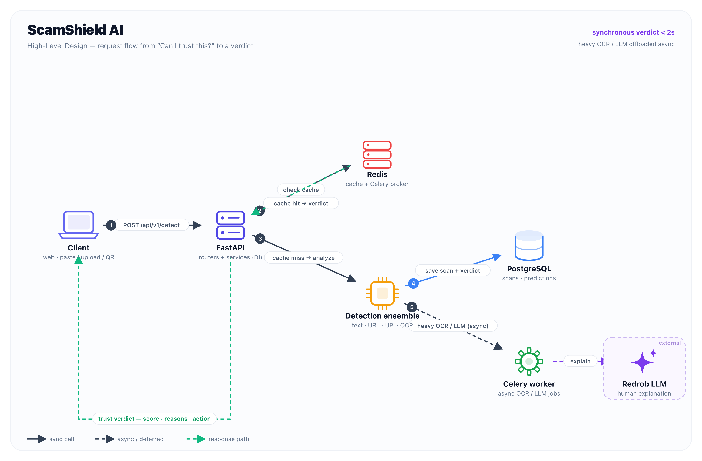

<div align="center">

# 🛡️ ScamShield AI

### *Before you click, pay, scan, or trust something online — ScamShield tells you whether you should.*

An AI digital-trust platform that turns a moment of doubt into an instant, plain-language verdict.
**Security for humans, not cybersecurity experts.**

`Next.js 15` · `FastAPI` · `PostgreSQL` · `Redis` · `Celery` · `TypeScript` · `Tailwind v4`

</div>

---

## What it does

Paste a suspicious message, upload a screenshot, analyze a URL, or scan a UPI/QR request — and get back a **calibrated trust score**, the **reasons behind it**, a **scam category**, and a **recommended action**, all explained in language anyone can understand.

```json
{
  "scam_probability": 96,
  "risk_level": "SCAM",
  "category": "KYC Scam",
  "reasons": [
    "Uses urgency tactics to force a quick decision",
    "Requests sensitive credentials (OTP / PIN / KYC)",
    "Impersonates SBI / a trusted bank",
    "Contains a suspicious shortened domain"
  ],
  "recommendation": "Delete this message. Do not click the link or share any details. Block the sender and report to 1930."
}
```

Built for everyday Indians: **UPI fraud, KYC scams, courier scams, job scams, investment fraud** — plus a **Family Protection** mode so people can shield their parents online.

---

## Architecture



> Request flow: **Client → FastAPI → (Redis cache) → Detection ensemble → PostgreSQL**, with heavy OCR/LLM work offloaded to **Celery**, and a sub-2s synchronous verdict returned to the user. Full diagram + source in [`docs/architecture/`](docs/architecture/README.md).

---

## Monorepo layout

```
ScamShield/
├── app/                 FastAPI backend (detection ensemble, services, repos, workers)
├── web/                 Next.js 15 frontend (trust analyzer UI, dark themed)
├── docs/architecture/   High-level design diagram (svg + png) + generator
├── alembic/             database migrations
├── scripts/             seed + diagram generators
└── deploy/ · docker-compose.yml · Dockerfile
```

| Part | Stack | More |
|---|---|---|
| **Backend** (`app/`) | FastAPI · SQLAlchemy · Pydantic · Celery · 7-engine detector ensemble | [backend details below](#backend-details) |
| **Frontend** (`web/`) | Next.js 15 · React 19 · TypeScript · Tailwind v4 · Framer Motion · Zustand · React Query · Recharts | [`web/README.md`](web/README.md) |
| **Design** (`docs/`) | HLD diagram, regenerable from `scripts/gen_hld.py` | [`docs/architecture/README.md`](docs/architecture/README.md) |

---

## Quick start

### Frontend (instant, no backend needed)

The UI ships a **demo mode** with curated verdicts, so it's playable immediately:

```bash
cd web
npm install
npm run dev          # → http://localhost:3000
```

Set `NEXT_PUBLIC_LIVE_API=1` (see `web/.env.example`) to call the real backend instead of demo data.

### Backend

```bash
cp .env.example .env          # then edit SECRET_KEY
docker compose up --build     # API on http://localhost:8000
docker compose exec api python -m scripts.seed   # categories + admin user
```

<details>
<summary>Local dev without Docker</summary>

```bash
python -m venv .venv && source .venv/bin/activate
pip install -r requirements-dev.txt
export SECRET_KEY=dev-secret
# start Postgres + Redis (or: docker compose up db redis)
alembic upgrade head
python -m scripts.seed
uvicorn app.main:app --reload
```
</details>

- Swagger UI → <http://localhost:8000/docs> · ReDoc → `/redoc` · Metrics → `/metrics`
- Tests → `pytest` (runs against in-memory SQLite, no services needed)

---

## API (v1)

| Method | Path | Auth | Purpose |
|---|---|---|---|
| POST | `/api/v1/auth/register` · `/login` · `/refresh` | — | Accounts & tokens |
| POST | `/api/v1/detect/text` · `/url` · `/email` · `/upi` · `/image` | ✅ | Run detection on each input type |
| GET | `/api/v1/history` · `/history/{id}` | ✅ | Scan history & detail |
| POST | `/api/v1/history/{id}/feedback` | ✅ | Report correctness (active learning) |
| GET | `/api/v1/stats/overview` | — | **Public** aggregate metrics for the landing page |
| GET | `/api/v1/admin/stats` · `/scam-trends` | 🛡️ | Platform analytics |
| GET | `/health` · `/ready` · `/metrics` | — | Ops |

---

## Backend details

**The 7 detection engines (`app/detectors/`)**

1. **TextDetector** — urgency, threats, KYC, lottery, investment, job, credential-theft.
2. **URLDetector** — TLD/entropy/shortener/punycode/phishing-keyword reputation.
3. **OCRDetector** — extracts text from screenshots (EasyOCR/PaddleOCR) back into the pipeline.
4. **UPIDetector** — collect-request traps, fake payment proofs, QR/VPA risk.
5. **ImpersonationDetector** — bank / RBI / income-tax / courier / telecom impersonation.
6. **LLMDetector** — LLM-powered reasoning + recommendations (graceful template fallback).
7. **EnsembleDetector** — confidence-weighted fusion → final 0–100 score, risk level, category, reasons.

**Design principles**

| Concern | Decision |
|---|---|
| Engine pluggability | Each detector implements `BaseDetector.analyze → DetectorResult`. New engine = 1 class + 1 registry line. |
| Separation of concerns | `api → services → repositories → db`. Routes never touch SQLAlchemy. |
| Latency | Text/URL/UPI run in-request; OCR/LLM offload to Celery (`workers/`). |
| Model swap | Heuristics sit behind the *same* interface as real models. `ENABLE_HEAVY_MODELS=true` loads them with zero API changes. |
| Explainability | Each engine emits weighted signals persisted as `RiskFactor` rows for auditing & active learning. |
| Observability | Structured JSON logs, Prometheus `/metrics`, OpenTelemetry tracing, Sentry hook. |
| Scale | Stateless API, pooled connections, Redis cache, async heavy work, indexed/partition-ready schema. |

**Schema:** `users · scans · predictions · risk_factors · feedback · scam_categories` — UUID PKs, timestamps, cascade FKs, hot-path indexes, managed via Alembic.

---

<div align="center">
<sub>Made with care for safer digital lives. In an emergency, call the Indian cyber helpline <b>1930</b>.</sub>
</div>
